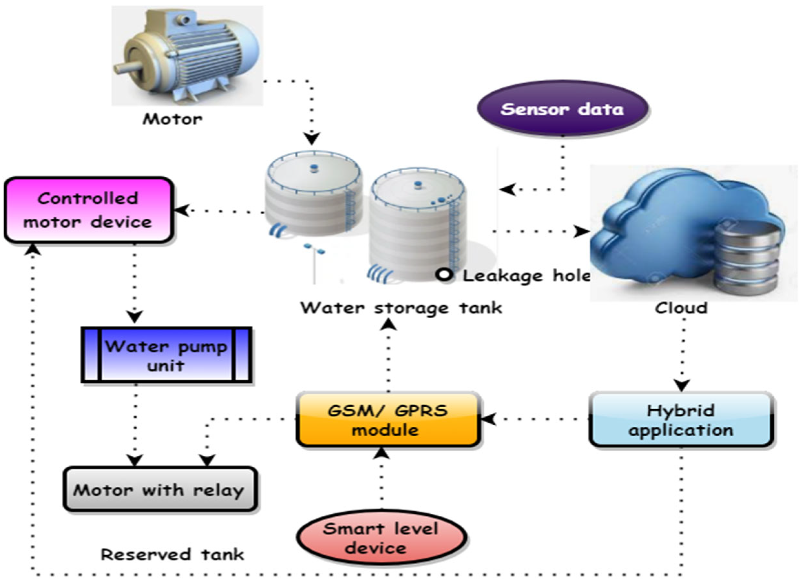

# Smart India Hackathon Workshop
# Date:
## Register Number:24901015
## Name: khamalraaj S
## Problem Title
Implementation of the Alumni Association platform for the University/Institute.
## Problem Description
Background: Alumni associations play a pivotal role in fostering lifelong connections between graduates and their alma mater, facilitating networking, mentorship, and philanthropic support. However, many alumni associations face challenges in maintaining engagement, facilitating donations, and providing valuable services such as job networking and tracking alumni success stories. A comprehensive Alumni Association platform for a University/Institute, encompassing both web and mobile applications, aims to address these challenges effectively. Detailed Description: The proposed Alumni Association platform for the Government Engineering College will feature robust functionalities accessible through both web and mobile applications: Alumni Registration: User-friendly registration processes on both web and mobile platforms, allowing alumni to join the association, update their profiles, and stay connected with peers and the institution. Donation Portal: Secure mechanisms on both platforms for alumni to contribute donations easily and support various initiatives and projects undertaken by the college, fostering a culture of philanthropy. Networking Hub: Dedicated sections on both platforms to connect alumni based on shared interests, professions, and geographic locations, facilitating professional networking, mentorship, and collaboration opportunities. Job Portal: Integrated job search and posting features accessible via web and mobile apps, enabling alumni to explore career opportunities, post job openings, and connect with potential employers within the alumni network. Alumni Directory: Search functionalities available on both platforms to find alumni based on different criteria such as graduation year, field of study, industry, location, etc., promoting networking and community building. Success Story Tracking: Features on both web and mobile apps to showcase and track alumni achievements, success stories, and notable contributions to society, inspiring current students and fostering pride among alumni. Events and Reunions: Announcements, registrations, and management tools available on both platforms for organizing alumni events, reunions, workshops, and professional development sessions to maintain engagement and connection. Feedback and Surveys: Channels on both web and mobile apps for alumni to provide feedback on their experiences, suggest improvements, and participate in surveys to help shape future initiatives of the association. The platform will prioritize user experience, security, and scalability across both web and mobile applications to cater to the diverse needs of the Government Engineering College's alumni community. Expected Solution: Implementation of the Alumni Association platform for the Government Engineering College, comprising both web and mobile applications, is expected to achieve several positive outcomes: Enhanced Alumni Engagement: Seamless access to networking, career opportunities, and alumni events through web and mobile apps will strengthen connections among alumni, fostering a vibrant and active community. Increased Philanthropic Support: Convenient donation processes accessible via both platforms will encourage alumni to contribute towards the college's growth and development initiatives. Career Advancement: Access to job postings, mentorship opportunities, and professional networking on mobile devices will support alumni in their career growth and advancement. Knowledge Sharing: Exchange of knowledge, experiences, and best practices facilitated through both web and mobile apps will enrich professional development and lifelong learning initiatives. Pride and Recognition: Highlighting alumni achievements and success stories on both platforms will instill pride in the alma mater and inspire current students to excel in their academic and professional pursuits. Community Building: Interactive features available on both web and mobile apps will nurture a sense of belonging and camaraderie among alumni, strengthening their bond with the institution. In summary, the Alumni Association platform for the University/Institute, integrated with both web and mobile applications, aims to create a dynamic and supportive ecosystem where alumni can connect, contribute, and thrive, thereby enriching the overall educational experience and legacy of the institution.
## Problem Creater's Organization
Government of Gujarat

## Idea
Title: Smart Water Management System

Description: Develop a system to monitor and manage water usage in urban areas using IoT and AI.

Solution Approach:-

1. Understanding the Problem

  Objective: Optimize water usage and reduce wastage.

  Challenges: Real-time monitoring, data integration, and predictive analysis.

2. Data Collection

  Sensors: Install IoT sensors in water meters to monitor usage.

  Weather Data: Collect weather data for predictive analysis.

3. Data Preprocessing

  Cleaning: Remove any irrelevant or noisy data.

  Normalization: Standardize data for consistency.

4. Model Development

  Algorithm Selection: Use AI algorithms for usage prediction and anomaly detection.

  Training: Train the model using historical water usage data.

5. Implementation

  Deployment: Deploy the system on a cloud platform.

  API Development: Create APIs for real-time data access.

  User Interface: Develop a dashboard for monitoring and management.

6. Testing and Optimization

  Performance Testing: Ensure the system performs well under various conditions.

  Optimization: Fine-tune the model for better accuracy and efficiency.

## Proposed Solution / Architecture Diagram

## Use Cases
1.  Leak Detection: IoT sensors can detect leaks in the water distribution system, reducing water wastage and maintenance costs.

2.  Usage Monitoring: Real-time monitoring of water usage can help in identifying patterns and promoting water conservation.

3.  Demand Forecasting: AI algorithms can predict water demand based on historical data and weather patterns, ensuring efficient water distribution.

4.  Public Awareness: Citizens can receive alerts about water usage and conservation tips through a mobile app.

## Technology Stack
Frontend
* Web Application: React.jsor Angular

* Mobile Application: React Native or Flutter

Backend
* Server: Node.jsor Django

* Database: PostgreSQL or MongoDB

* API: RESTful APIs or GraphQL

IoT and Sensors
* Microcontrollers: Arduino or Raspberry Pi

* Communication Protocols: MQTT or HTTP

Cloud Services
* Platform: AWS, Azure, or Google Cloud

* Storage: AWS S3, Google Cloud Storage

Data Analytics
* Tools: Apache Spark, Hadoop

* Visualization: Tableau, Power BI

DevOps
* CI/CD: Jenkins, GitHub Actions

* Containerization: Docker, Kubernetes

## Dependencies
Frontend Dependencies
* React.js: react, react-dom

* Angular: @angular/core, @angular/common

* React Native: react-native, react-navigation

* Flutter: flutter, cupertino_icons

Backend Dependencies
* Node.js: express, mongoose, body-parser

* Django: django, djangorestframework, django-cors-headers

* PostgreSQL: psycopg2

* MongoDB: mongoose

IoT and Sensors Dependencies
* Arduino: Arduino IDE, WiFi101, MQTT

* Raspberry Pi: RPi.GPIO, paho-mqtt

Cloud Services Dependencies
* AWS: boto3, aws-sdk

* Azure: azure-storage, azure-functions

* Google Cloud: google-cloud-storage, google-cloud-functions

Data Analytics Dependencies
* Apache Spark: pyspark

* Hadoop: hadoop-common, hadoop-hdfs

* Tableau: Tableau Desktop

* Power BI: Power BI Desktop

DevOps Dependencies
* Jenkins: jenkins, jenkins-cli

* GitHub Actions: actions/checkout, actions/setup-node

* Docker: docker, docker-compose

* Kubernetes: kubernetes, kubectl

